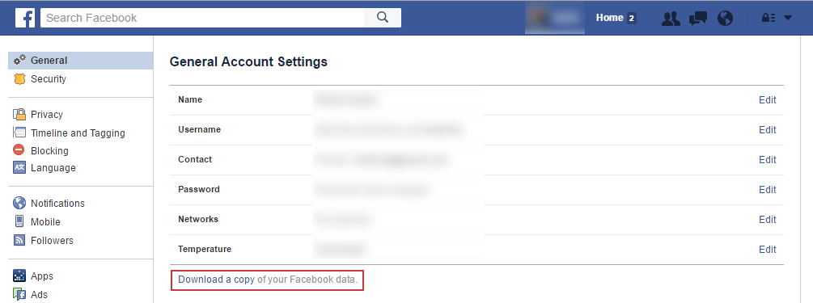

# fb-message-analyzer

Analyze and graph your Facebook Messages!

## Downloading FB Messsages

Click on Settings

Click to download your archive.

The download took around 30min for most people so check back there later to download the archive.

## Running the program

Either get a binary from the release page or install the necessary libraries and run main.py

Libraries Required:
Numpy
Matplotlib

